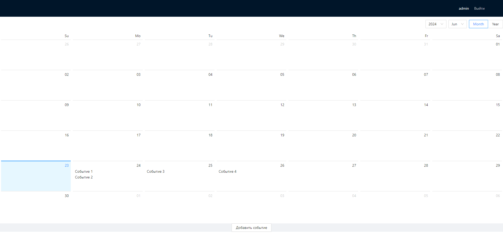

## React календарь с добавлением событий для конкретного пользователя

- ### Проект доступен по ссылке - https://vadim-strakhov.github.io/react_ts_redux_calendar/
- ### Данные для входа - user:user, admin:admin
- ### В проекте реализована простая авторизация и добавление событий в календаре одним пользователем другому
- ### Технологии - `react`, `redux`, `typescript`, `redux-thunk`, `axios`, `ant-design`, `react-router-dom`

